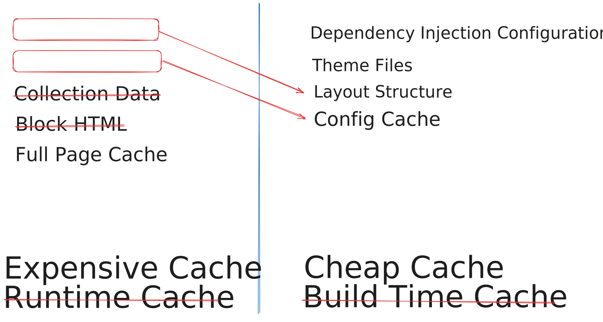

# Optimizing Cache for Saving Cash 

---

# About me

<v-clicks>

🫶 Passionate about open source projects

🚀 Expert in optimizing web appplications

👴🏻 One of grand-parents of Magento

🧑‍🚒 Experienced in putting out fires on production systems

</v-clicks>

---

---
layout: fact
---

## Cache Types

---
layout: fact
---


---
layout: fact
---


---
layout: fact
---



--- 

# Low cache hit ratio

<v-clicks>

🗂️ Too much cache variations

🔄 High frequency of updates

🚫 Aggressive cache eviction

</v-clicks>

--- 

# Possible solutions

<v-clicks>

✂️ Reduce cache variations by splitting cache records

🛠️ Remove cache and optimize underlying slow generation

📬 Queue cache flushes in batches

⚙️ Atomic cache writes / soft purging

</v-clicks>

---

# Problem: Layout Cache


<v-clicks>

🔑 Each unique entity has its own cache key for layout

🧩 Most of the layout is the same across entity type

📈 On large catalogs, cache can grow into 20Gbytes+ overtime

</v-clicks>

---

# Source: Entity Specific Handles

```php {all|4,9}
public function addPageLayoutHandles(
  array $parameters = [], 
  $defaultHandle = null, 
  $entitySpecific = true
 ) {
    // ...
    foreach ($parameters as $key => $value) {
        // ...
        $pageHandle = $handle . '_' . $key . '_' . $value;
        $pageHandles[] = $pageHandle;
        if ($entitySpecific) {
            $this->entitySpecificHandlesList->addHandle($pageHandle);
        }
    }
}
```

---

# Quickfix

<v-clicks>

🔌 Create plugin for `Magento\Framework\View\Result\Page`

✅ If `$entitySpecific` parameter equals true, return without executing the original method

</v-clicks>

---

# Example Code

```php {all|6,8|9|11}
class RemoveEntityCache
{
    public function aroundAddPageLayoutHandles(
        Page $subject, callable $proceed, array $parameters = [], 
        $defaultHandle = null, 
        $entitySpecific = true
    ) {
        if ($entitySpecific) {
            return true;
        }
        return $proceed($parameters, $defaultHandle, $entitySpecific);
    }
}
```

---

# Problem: Configurable Products

<v-clicks>

🔄 Each time you use `getUsedProducts()` data gets cached in Redis

📈 Cache size grows with your catalog

🚫 Too volatile as it gets flushed on almost every product sale

</v-clicks>

---

# Quickfix

<v-click>

🚫 Disable `used_products_cache` plugin on `Magento\ConfigurableProduct\Model\Product\Type\Configurable`  

</v-click>


---

# DI Config for Frontend

```xml
<type name="Magento\ConfigurableProduct\Model\Product\Type\Configurable">
    <plugin name="used_products_cache" disabled="true" />
</type>
```

---

# Result

😱 With both fixes applied it reduces max Redis cache usage to under 10Mbytes on most datasets

---

# Problem: Low Varnish Hit Ratio

<v-clicks>

🍪 `X-Magento-Vary` cookie affects page variations in cache

🛠️ Generated based on values set in `Magento\Framework\App\Http\Context`

</v-clicks>

---

# Possible Solution

<v-clicks>

🔓 Remove dependency on HTTP context

🔑 Create own unique values if content differs

🧹 Add soft purging with XKey/YKey


</v-clicks>

---

# Problem: Double Rendering

<v-clicks>

🖼️ Rendering of ESI blocks still happens even when block is replaced with `<esi:include />` snippet

</v-clicks>

---

# Quickfix

<v-click>

🚫 Prevent rendering by around plugin on `renderNonCachedElement` of `Magento\Framework\View\Layout`

</v-click>

---

# Example Code

```php{all|6|7|8|10|11}
class SkipRenderLayoutElement
{
    public function aroundRenderNonCachedElement(
      Layout $layout, callable $proceed, string $name
    ) {
        if ($this->pageCacheConfig->isEnabled()
            && $this->pageCacheConfig->getType() === Config::VARNISH
            && $layout->isCacheable()) {
            $block = $layout->getBlock($name);
            if ($block instanceof AbstractBlock && $block->getTtl() !== null) {
                return '';
            }
        }
        return $proceed($name);
    }
}
```

---

# Problem: Cacheable Shopping Cart

<v-clicks>

🛒 Persistent Shopping Cart checks on every cacheable page if the cart expired

⚠️ Full cart load operation gets triggered on unrelated page

</v-clicks>

---

# Quickfix

<v-clicks>

🔌 Create plugin for `\Magento\Persistent\Helper\Data`

🛠️ Create after-plugin for `canProcess()` method

🚫 Prevent triggering observer if request path does not match `/customer` or `/checkout` paths

</v-clicks>

---


# Example Code

```php{all|6|7|8|9|10}
class PreventRunningObserverPlugin
{
    public function afterCanProcess(
        Data $subject, bool $result, $observer
    ) {
        if ($request = $observer->getRequest()) {
            if ($request->isGet()
                && !str_starts_with($request->getRequestUri(), '/checkout')
                && !str_starts_with($request->getRequestUri(), '/customer')) {
                return false;
            }
        }
        return $result;
    }
}
```

---
layout: two-cols
---

# Thank You!

## Support Charities

- Ukrainian Foundation "Come Back Alive"

  https://savelife.in.ua/en/


- Dutch Foundation "Sails of Freedom"

  https://zeilenvanvrijheid.nl/

::right::

# &nbsp;

## Help Ukraine 🇺🇦

 


